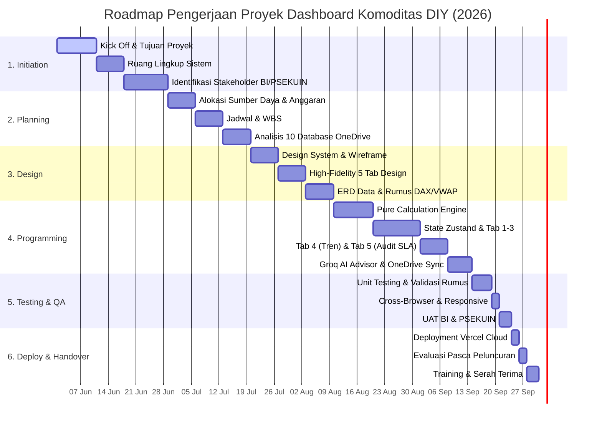

# B. Dokumentasi Proses Perencanaan
## Proyek Pengembangan Dashboard Intelijen & Analitik Aliran Komoditas Pangan Strategis DIY
### Kolaborasi: Kantor Perwakilan Bank Indonesia DIY & PSEKUIN UPN "Veteran" Yogyakarta

---

Tahap perencanaan menyangkut studi tentang kebutuhan pengguna (*user specification*), studi-studi kelayakan (*feasibility study*) baik secara teknik maupun secara teknologi serta penjadwalan suatu proyek sistem informasi atau perangkat lunak (Sofyan, 2016). Hal ini dilakukan dengan merencanakan tujuan dan sasaran dalam pembuatan *software*.

---

## 1. Pendahuluan

### 1.1 Tujuan dokumen
Tujuan dari pembuatan dokumen perencanaan ini adalah untuk menyediakan panduan yang terstruktur dan rinci mengenai proses pengembangan perangkat lunak, mencakup aspek-aspek seperti jadwal pengerjaan, sumber daya yang dibutuhkan, anggaran biaya, manajemen risiko, strategi komunikasi, dan ruang lingkup dari pengembangan aplikasi **Dashboard Intelijen & Analitik Aliran Komoditas Pangan Strategis DIY**. Dokumen ini berfungsi sebagai acuan bagi seluruh tim yang terlibat dalam pengembangan—termasuk Kantor Perwakilan Bank Indonesia DIY, Tim Peneliti PSEKUIN UPN "Veteran" Yogyakarta, dan pengembang sistem—untuk memastikan keselarasan visi, efisiensi proses, serta tercapainya hasil yang sesuai dengan spesifikasi yang telah ditentukan. Dengan adanya dokumen ini nantinya akan menjadi bahan evaluasi apabila terdapat permasalahan dalam pengerjaan terkait waktu, sumber daya, anggaran, dan ruang lingkup dari pembuatan aplikasi.

### 1.2 Ruang lingkup identifikasi kebutuhan
Ruang lingkup pengembangan sistem didasari dari kebutuhan institusi (Bank Indonesia KPw DIY dan Tim Pengendalian Inflasi Daerah / TPID DIY) mengenai pengelolaan data serta informasi berkaitan dengan:
1. Pemantauan volume aliran masuk (*inflow*) dan aliran keluar (*outflow*) 16 komoditas pangan pokok strategis di 5 kabupaten/kota se-Provinsi DIY (Kota Yogyakarta, Kab. Sleman, Kab. Bantul, Kab. Kulon Progo, dan Kab. Gunungkidul).
2. Perhitungan neraca perdagangan bersih wilayah (*net trade balance*), penetapan status surplus, defisit, dan seimbang.
3. Transmisi harga beli vs harga jual menggunakan metode *Volume-Weighted Average Price (VWAP)* serta evaluasi marjin tataniaga pedagang besar dan produsen.
4. Analisis deret waktu (*time series*) multi-pekan (W23 s.d. W38 tahun 2026) dan disparitas pertumbuhan pasokan antar-wilayah.
5. Pemantauan kualitas data survei mingguan, audit record anomali, dan evaluasi kepatuhan pelaporan responden (*SLA Compliance*).
6. Sintesis intelijen rekomendasi kebijakan otomatis 3 pilar (Logistik & Pasokan, Kerjasama Antar Daerah / KAD, dan Stabilisasi Harga) berbasis *Generative AI Groq LPU*.

Sistem berbentuk *web-based analytics application* (*Single Page Application / SPA*) yang dibangun menggunakan teknologi modern: **React 19, JavaScript (ES6+), TailwindCSS, Leaflet GIS, Lucide Icons, Recharts**, manajemen state terpusat **Zustand**, mesin kalkulasi murni (*Pure Deterministic Functions*), serta *serverless API gateway* (Node.js) yang terhubung ke model LLM **Groq LPU (`openai/gpt-oss-120b`)** dengan database master terintegrasi dari 10 berkas survei Microsoft OneDrive.

---

## 2. Latar Belakang

### 2.1 Deskripsi sistem yang akan dikembangkan
**Dashboard Komoditas DIY (Dashboard-Tirta)** adalah sistem informasi intelijen dan analitik aliran pangan strategis berbasis web yang dikembangkan untuk membantu proses pengolahan, pemantauan, dan visualisasi data survei rantai pasok pangan mingguan dari pelaku usaha utama (Pedagang Besar dan Produsen) di Provinsi DIY agar proses analisis ekonomi makro dan pengendalian inflasi menjadi jauh lebih cepat, akurat, dan efektif. Sistem informasi ini membutuhkan beberapa perangkat lunak dan keras untuk bisa digunakan oleh aktor **Pimpinan Bank Indonesia & Anggota TPID**, **Analis Data PSEKUIN**, **Dinas Perdagangan/Ketahanan Pangan**, dan **Enumerator Survei**.

Adapun fungsi utama sistem yakni:
1. Mengintegrasikan dan menormalkan data dari 10 database survei mentah OneDrive menjadi satu *Master Database* terpadu (berisi 5.120 catatan data transaksi).
2. Menyajikan 5 tab analitik utama:
   - **Tab 1: Ringkasan Utama & Neraca Perdagangan DIY** (KPI Neraca Makro, Line Chart Tren, Matriks 16 Komoditas $\times$ 5 Wilayah, dan *Butterfly Mirrored Bar Chart*).
   - **Tab 2: Detail Arus Masuk vs Keluar** (Matriks 3 sub-kolom Masuk-Keluar-Selisih, Diagram Dekomposisi Pohon Kontribusi Wilayah, dan Tabel Direktori Responden dengan pencarian & paginasi).
   - **Tab 3: Transmisi Harga & Marjin Tataniaga** (Tabel transmisi harga beli/jual VWAP, Peringkat Marjin %, dan *Scatter Plot* Disparitas Harga vs Volume).
   - **Tab 4: Tren Antarwaktu** (Dinamika multi-pekan W23–W38, visualisasi delta pertumbuhan $\Delta\%$, dan evolusi pasokan 8 komoditas utama).
   - **Tab 5: Kualitas Data & Monitoring SLA** (Audit anomali harga Rp 0, satuan tidak baku, record *soft-deleted*, dan persentase kepatuhan SLA pelaporan per kabupaten).
3. Menyediakan fitur **Executive Intelligence Advisor** berbasis *Groq LPU Generative AI* yang merumuskan ringkasan naratif kebijakan 3 pilar secara instan (< 1 detik) lengkap dengan tombol *Salin Narasi* untuk bahan paparan pimpinan.

### 2.2 Tujuan Proyek
Proyek ini memiliki tujuan untuk memperbaiki kurang efektif serta efisiennya pengelolaan data survei komoditas pangan mingguan di Provinsi DIY. Sebelum adanya sistem ini, pengumpulan data dilakukan secara terfragmentasi pada 10 database lembar kerja Microsoft OneDrive terpisah (5 kabupaten $\times$ 2 klaster pedagang besar dan produsen). Kondisi tersebut menyebabkan beberapa kendala serius:
- **Keterlambatan Analisis (*Time-Lag*)**: Pengolahan data secara manual memakan waktu 3–5 hari pasca survei, sehingga rekomendasi intervensi pasar oleh TPID sering terlambat.
- **Risiko Inkonsistensi & Kesalahan Rumus**: Perhitungan rata-rata harga sering menggunakan rata-rata sederhana (*Simple Average*) alih-alih rata-rata tertimbang volume (*VWAP*), memicu distorsi analisa.
- **Ketiadaan Visibilitas Terpadu**: Pengambil kebijakan kesulitan melihat komoditas mana yang defisit di Sleman namun surplus di Bantul dalam satu layar terintegrasi.
- **Kebutuhan Sintesis Narasi Otomatis**: Penyusunan poin kebijakan untuk rapat koordinasi mingguan pimpinan memerlukan pembacaan data mentah yang memakan waktu.

#### A. Tujuan
Tujuan proyek ini adalah membuat sistem intelijen dan *dashboard* analitik aliran komoditas pangan strategis berbasis website interaktif yang memusatkan data 10 database OneDrive, mengotomatisasi perhitungan neraca dan transmisi harga secara presisi, serta menyediakan rekomendasi kebijakan berbasis AI yang memudahkan pemangku kepentingan dalam merumuskan stabilisasi pasokan dan pengendalian inflasi daerah.

#### B. Sasaran
Adapun sasaran pada proyek ini adalah sebagai berikut:
1. **Digitalisasi & Integrasi Penuh**: Mengintegrasikan 100% data survei dari 10 database OneDrive ke dalam 1 Master Database terpusat (5.120 baris data terstruktur).
2. **Reduksi Waktu Pengolahan Data (*Zero Time-Lag*)**: Mempercepat proses agregasi dan kalkulasi data dari **3–5 hari kerja** menjadi **kurang dari 1 detik (< 50 milidetik untuk kalkulasi lokal, < 1,5 detik untuk inferensi AI)**.
3. **Peningkatan Akurasi Analisis Hingga 99%**: Mengeliminasi bias perhitungan volume dan harga melalui algoritma matematis *VWAP*, perlakuan khusus komoditas cair (*Liquid-Awareness*), dan audit mutu data otomatis.
4. **Adopsi AI untuk Rekomendasi Kebijakan**: Menghasilkan 3 rekomendasi taktis (Logistik, Kerjasama Antar Daerah / KAD, Operasi Pasar) secara otomatis untuk setiap kombinasi filter wilayah dan komoditas.
5. **Target Penyelesaian Proyek**: Proyek diselesaikan dan siap diimplementasikan penuh pada bulan **September 2026**.

---

### 2.3 Jadwal Proyek

Jadwal pengerjaan proyek ini tercantum dalam tabel rincian kegiatan dan Gantt Chart sebagai berikut:

| Nama Kegiatan | Durasi | Mulai | Selesai |
| :--- | :---: | :---: | :---: |
| **Project Kick Off** | **0 hari** | **Senin, 01/06/2026** | **Senin, 01/06/2026** |
| **Initiation** | **28 hari** | **Senin, 01/06/2026** | **Minggu, 28/06/2026** |
| - Menentukan tujuan & sasaran proyek | 10 hari | Senin, 01/06/2026 | Rabu, 10/06/2026 |
| - Menentukan ruang lingkup sistem | 7 hari | Kamis, 11/06/2026 | Rabu, 17/06/2026 |
| - Identifikasi kebutuhan stakeholder (BI & PSEKUIN) | 11 hari | Kamis, 18/06/2026 | Minggu, 28/06/2026 |
| **Planning** | **21 hari** | **Senin, 29/06/2026** | **Minggu, 19/07/2026** |
| - Menentukan alokasi sumber daya & anggaran | 7 hari | Senin, 29/06/2026 | Minggu, 05/07/2026 |
| - Membuat jadwal pengerjaan & WBS | 7 hari | Senin, 06/07/2026 | Minggu, 12/07/2026 |
| - Analisis struktur 10 database OneDrive & standarisasi | 7 hari | Senin, 13/07/2026 | Minggu, 19/07/2026 |
| **Design (UI/UX & Arsitektur)** | **21 hari** | **Senin, 20/07/2026** | **Minggu, 09/08/2026** |
| - Wireframing & Design System Bank Indonesia | 7 hari | Senin, 20/07/2026 | Minggu, 26/07/2026 |
| - High-Fidelity Design 5 Tab & Slicer Bar | 7 hari | Senin, 27/07/2026 | Minggu, 02/08/2026 |
| - Perancangan Skema Data (ERD) & Algoritma DAX/VWAP | 7 hari | Senin, 03/08/2026 | Minggu, 09/08/2026 |
| **Programming (Frontend & Backend AI)** | **35 hari** | **Senin, 10/08/2026** | **Minggu, 13/09/2026** |
| - Pembuatan Pure Calculation Engine (DAX, VWAP, Net) | 10 hari | Senin, 10/08/2026 | Rabu, 19/08/2026 |
| - Pembangunan State Zustand, Slicers, & Tab 1-3 | 12 hari | Kamis, 20/08/2026 | Senin, 31/08/2026 |
| - Pembangunan Tab 4 (Tren) & Tab 5 (Kualitas Data/SLA) | 7 hari | Selasa, 01/09/2026 | Senin, 07/09/2026 |
| - Integrasi Serverless Groq AI Advisor & OneDrive Sync | 6 hari | Selasa, 08/09/2026 | Minggu, 13/09/2026 |
| **Testing & Quality Assurance** | **10 hari** | **Senin, 14/09/2026** | **Rabu, 23/09/2026** |
| - Unit Testing Formula Matematika & Validasi Satuan | 5 hari | Senin, 14/09/2026 | Jumat, 18/09/2026 |
| - Cross-Browser, Responsive, & Load Testing | 2 hari | Sabtu, 19/09/2026 | Minggu, 20/09/2026 |
| - User Acceptance Testing (UAT) bersama BI & PSEKUIN | 3 hari | Senin, 21/09/2026 | Rabu, 23/09/2026 |
| **Launching & Deployment** | **4 hari** | **Kamis, 24/09/2026** | **Minggu, 27/09/2026** |
| - Deployment ke Cloud Serverless Vercel | 2 hari | Kamis, 24/09/2026 | Jumat, 25/09/2026 |
| - Evaluasi Pasca Peluncuran & Pengujian Live | 2 hari | Sabtu, 26/09/2026 | Minggu, 27/09/2026 |
| **Training & Serah Terima** | **3 hari** | **Senin, 28/09/2026** | **Rabu, 30/09/2026** |
| - Pelatihan Penggunaan untuk Analis & Enumerator | 2 hari | Senin, 28/09/2026 | Selasa, 29/09/2026 |
| - Serah Terima Dokumen & Source Code | 1 hari | Rabu, 30/09/2026 | Rabu, 30/09/2026 |

---

### Visualisasi Gantt Chart Proyek (Juni 2026 - September 2026)

---

### Sumber Daya, Anggaran, dan Biaya Perkiraan Proyek

Adapun sumber daya, alokasi tim, dan rincian estimasi biaya pada proyek ini disusun secara profesional mencakup tenaga ahli dan infrastruktur cloud:

| Sumber Daya | Tipe | Grup | Jumlah | Biaya Perbulan | Biaya Perjam | Total Biaya (4 Bulan) |
| :--- | :---: | :---: | :---: | :---: | :---: | :---: |
| **Project Manager** | Pekerja | Eksternal | 1 Orang | Rp 22.000.000,00 | Rp 275.000,00 | Rp 88.000.000,00 |
| **Lead Data Analyst** | Pekerja | Internal (PSEKUIN) | 2 Orang | Rp 16.000.000,00 | Rp 200.000,00 | Rp 128.000.000,00 |
| **UI/UX Designer** | Pekerja | Internal | 1 Orang | Rp 14.000.000,00 | Rp 175.000,00 | Rp 56.000.000,00 |
| **Frontend Lead Engineer** | Pekerja | Eksternal | 2 Orang | Rp 18.000.000,00 | Rp 225.000,00 | Rp 144.000.000,00 |
| **Backend & AI Engineer** | Pekerja | Eksternal | 1 Orang | Rp 19.000.000,00 | Rp 240.000,00 | Rp 76.000.000,00 |
| **Quality Assurance / Tester** | Pekerja | Eksternal | 1 Orang | Rp 12.000.000,00 | Rp 150.000,00 | Rp 48.000.000,00 |
| **Domain & SSL (.go.id / .id)** | Material | Eksternal | 1 Paket | Rp 50.000,00 | - | Rp 600.000,00 |
| **Serverless Cloud Hosting** | Material | Eksternal (Vercel) | 1 Paket | Rp 0,00 *(Free Tier)* | - | Rp 0,00 |
| **Groq LPU AI Cloud API** | Material | Eksternal (Groq) | 2 Keys | Rp 0,00 *(Developer Tier)* | - | Rp 0,00 |
| **Operasional & Kuota Riset** | Cost | Internal | 4 Bulan | Rp 1.500.000,00 | - | Rp 6.000.000,00 |
| **TOTAL ESTIMASI ANGGARAN BIAYA PROYEK** | | | | | | **Rp 546.600.000,00** |

---

### 2.3 Manajemen Resiko

Manajemen risiko dilakukan dengan melakukan Identifikasi Risiko dan rencana mitigasi komprehensif sebagai berikut:

#### Identifikasi Risiko:
- **A.** Proyek tidak selesai sesuai dengan jadwal pekanan yang telah ditentukan akibat perubahan format survei lapangan.
- **B.** Biaya dan alokasi jam kerja melebihi anggaran yang telah direncanakan.
- **C.** Kode perhitungan yang dihasilkan tidak memenuhi standar atau menimbulkan perbedaan angka (*discrepancy bug*) dengan rumus DAX Power BI.
- **D.** Tautan OneDrive memblokir akses pembacaan data langsung dari peramban karena kebijakan keamanan *Cross-Origin Resource Sharing (CORS / 403 Forbidden)*.
- **E.** Inkonsistensi data satuan komoditas cair (Minyak Goreng: Ton vs Liter) yang menyebabkan volume bernilai 0.
- **F.** Batas kuota gratis (*Rate Limit*) pada API AI Groq habis saat penggunaan bersamaan oleh banyak anggota TPID.
- **G.** Antarmuka *dashboard* lambat (*lag / freeze*) saat pengguna memproses dan memfilter 5.120 baris data secara simultan.
- **H.** Website tidak tampil atau berfungsi dengan baik pada beberapa peramban web (*browser compatibility issue*) atau perangkat layar kecil.
- **I.** Terjadi anomali penginputan data oleh enumerator (harga Rp 0 atau record terhapus/soft-deleted).
- **J.** Proyek tidak memenuhi ekspektasi pengambil kebijakan pimpinan Bank Indonesia DIY.

#### Rencana Mitigasi Risiko:
- **K.** Membuat jadwal proyek yang realistis dengan membagi pengerjaan ke dalam *sprint* 1 mingguan dan menetapkan *milestone* yang terukur.
- **L.** Menggunakan manajemen *state* terpusat dan repositori Git (GitHub) untuk memantau kemajuan pengerjaan harian.
- **M.** Mengisolasi seluruh formula matematika bisnis ke dalam modul terpisah (*Pure Functions* di `src/calculations/`) dan melakukan pengujian *dual-run* terhadap rumus Excel.
- **N.** Membangun *Serverless Function Proxy* pada `/api/sync-onedrive` serta menyiapkan dataset *fallback* mandiri di `public/data/masterDatabase.json`.
- **O.** Menerapkan algoritma *Liquid-Awareness* di `dataCleaningService.js` untuk secara otomatis mengenali dan mengonversi unit Minyak Goreng (`volume_ton ?? volume_liter`).
- **P.** Menerapkan mekanisme *Dual API Keys* pada Groq LPU serta menyiapkan algoritma *Heuristic Rule-Based Fallback* di `aiService.js` apabila koneksi AI terputus.
- **Q.** Mengoptimalkan performa komputasi di sisi klien menggunakan React `useMemo` sehingga pemfilteran 5.120 baris selesai dalam tempo < 15 milidetik.
- **R.** Menerapkan desain responsif menggunakan TailwindCSS dan melakukan *cross-browser testing* (Google Chrome, Microsoft Edge, Mozilla Firefox, Apple Safari).
- **S.** Membangun modul khusus **Tab 5 (Kualitas Data & SLA)** untuk mendeteksi secara otomatis nilai kosong, anomali satuan, dan tingkat kepatuhan pelaporan wilayah.
- **T.** Melakukan *Weekly Stakeholder Review* dan *Prototyping Review* bersama perwakilan Bank Indonesia dan PSEKUIN UPN sebelum rilis final.

---

### 2.4 Strategi Komunikasi

Rencana komunikasi yang dilakukan dalam proyek ini yaitu sebagai berikut:
- **A. Weekly Meeting**: Dilakukan seminggu sekali pada setiap hari Jumat bersama seluruh tim pengembang dan tim analis PSEKUIN untuk melaporkan progres pekerjaan mingguan.
- **B. Monthly / Milestone Review Meeting**: Dilakukan sebulan sekali bersama pimpinan dan *stakeholder* Bank Indonesia KPw DIY untuk mengevaluasi hasil sprint dan demonstrasi prototipe.
- **C. Ad-Hoc Meeting (Pertemuan Darurat)**: Dilakukan sewaktu-waktu secara fleksibel apabila ditemukan hambatan kritis (*blocker*) terkait integrasi API atau rekonsiliasi data.
- **D. Mid-Project Review**: Dilakukan saat proyek mencapai progres 50% untuk mengevaluasi kesesuaian arsitektur teknis dan rancangan 5 tab.
- **E. Post-Launch & Handover Meeting**: Dilakukan setelah peluncuran sistem untuk evaluasi performa *live*, pelatihan pengguna, dan serah terima dokumentasi teknis.

Saluran komunikasi yang digunakan yaitu sebagai berikut:
- **A. Komunikasi Harian Antar Anggota Tim**: Menggunakan grup komunikasi instan dan platform koordinasi harian.
- **B. Komunikasi Formal & Pelaporan**: Menggunakan Email resmi institusi untuk pengiriman laporan mingguan, notula rapat, dan dokumen persetujuan (*SLA*).
- **C. Rapat Daring (Online Meeting)**: Menggunakan Zoom / Google Meet untuk koordinasi jarak jauh dan sesi demonstrasi sistem.
- **D. Kolaborasi Desain & Repositori**: Menggunakan Figma untuk desain antarmuka serta GitHub untuk kolaborasi kode sumber secara *real-time*.

---

### 2.5 Kriteria Keberhasilan

Kriteria keberhasilan dalam proyek ini terdiri dari kriteria keberhasilan proyek dan metode evaluasi yang digunakan. Adapun kriteria keberhasilan proyek ini yaitu sebagai berikut:
- **A. Kesesuaian Fungsional 100%**: Seluruh 5 tab analitik (Neraca, Detail Arus, Transmisi Harga, Tren Antarwaktu, Kualitas Data) dan *Executive Intelligence AI Advisor* berjalan sesuai rancangan tanpa *error*.
- **B. Kecepatan Komputasi Tinggi (*High Performance*)**: Proses perhitungan agregasi 5.120 baris data selesai dalam < 50 milidetik dan waktu respon rekomendasi AI < 1,5 detik.
- **C. Kepuasan Pengguna & Estetika Standar Bank Indonesia**: Desain antarmuka profesional, intuitif, mudah dipahami oleh analis ekonomi maupun pimpinan, dan responsif di berbagai resolusi layar.
- **D. Keandalan Sistem (*Zero Critical Bug*)**: Sistem tidak mengalami *crash* atau *blank screen* selama pengujian dan masa uji coba berkat adanya mekanisme *failover dataset*.

Dalam melakukan evaluasi terhadap sistem, dilakukan beberapa metode pengujian:
- **A. Review dengan Stakeholder**: Sesi demonstrasi langsung kepada pimpinan Bank Indonesia KPw DIY dan analis PSEKUIN untuk meminta umpan balik.
- **B. Prototyping & Iterative Testing**: Pengujian prototipe interaktif secara bertahap mulai dari komponen slicer, grafik *Butterfly*, hingga *AI Intelligence Box*.
- **C. Pengujian Sistem (System Testing)**: Meliputi *Unit Testing* logika DAX/VWAP, *Integration Testing*, dan *End-to-End Build Validation* (`npm run build`).
- **D. Observasi Penggunaan Nyata**: Mengamati interaksi pengguna saat melakukan simulasi pemantauan inflasi komoditas mingguan.

---

### 2.6 Kesimpulan

Dokumen ini berisi rencana komprehensif pembuatan sistem **Dashboard Intelijen & Analitik Aliran Komoditas Pangan Strategis DIY** hasil kolaborasi Kantor Perwakilan Bank Indonesia DIY dan PSEKUIN UPN "Veteran" Yogyakarta. Langkah-langkah yang terdiri dari pendahuluan, identifikasi ruang lingkup, latar belakang dan deskripsi sistem, penjadwalan terinci, alokasi sumber daya dan anggaran, manajemen risiko, strategi komunikasi, serta kriteria keberhasilan telah disusun secara terstruktur. Dengan adanya dokumen perencanaan ini, diharapkan terciptanya sistem yang selesai tepat waktu, terukur, handal, dan mampu memberikan kontribusi nyata dalam perumusan kebijakan stabilisasi pasokan pangan dan pengendalian inflasi daerah di Provinsi DIY. 

Langkah selanjutnya setelah melakukan perencanaan dari sistem adalah melakukan analisis mendalam yang terdiri dari analisis kebutuhan fungsional dan non-fungsional dari sistem.

---
*Dokumen B. Dokumentasi Proses Perencanaan Proyek - Dashboard Komoditas DIY (2026)*
