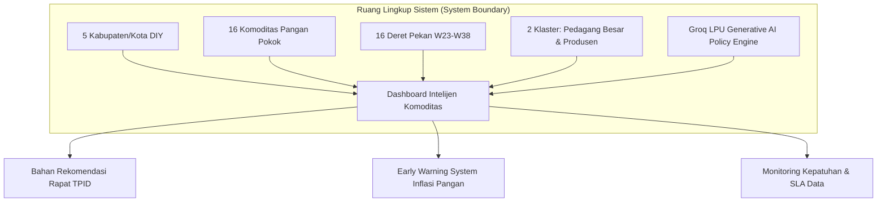
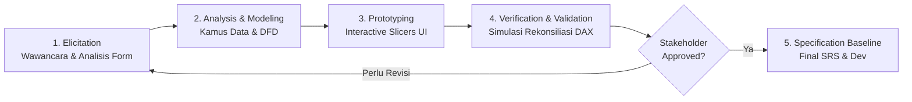
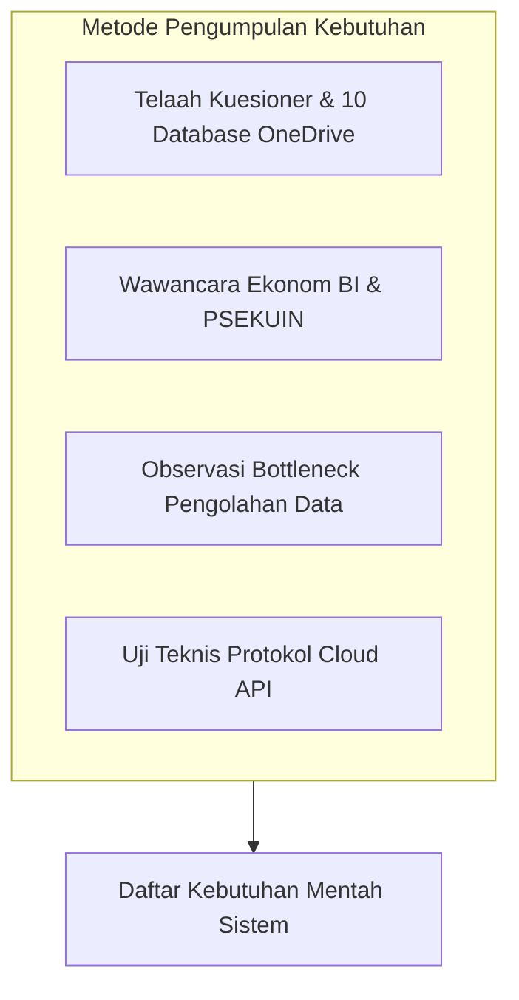
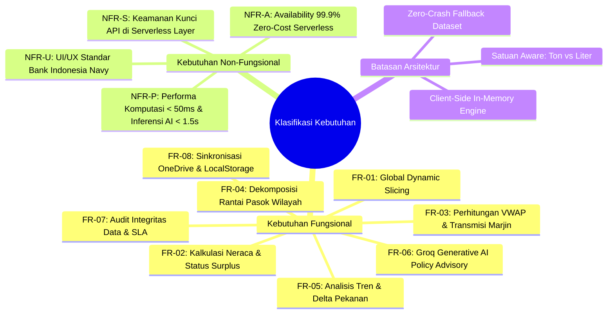
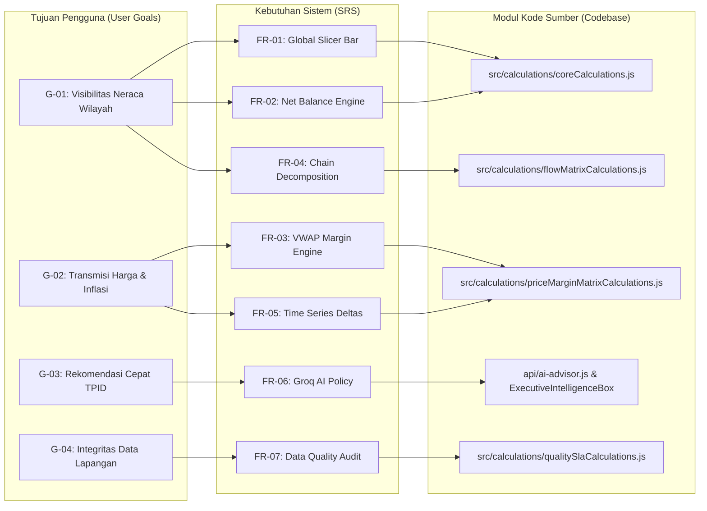
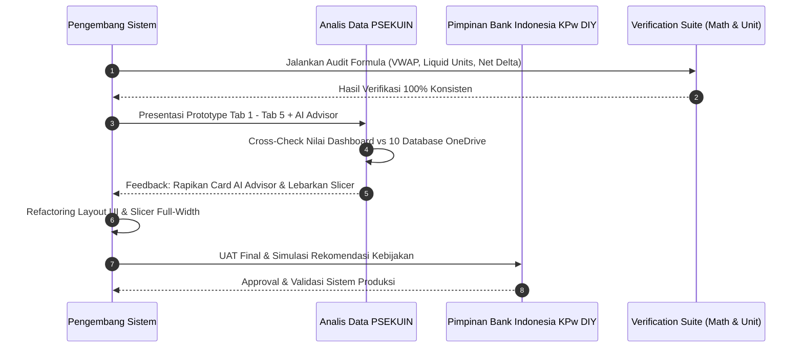
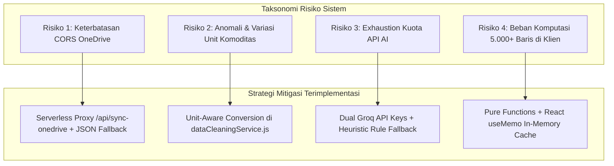

# DOKUMEN IDENTIFIKASI & ANALISIS KEBUTUHAN PERANGKAT LUNAK
## SISTEM INTELIJEN & DASHBOARD ANALITIK ALIRAN KOMODITAS PANGAN STRATEGIS DAERAH ISTIMEWA YOGYAKARTA (DIY)
### Kantor Perwakilan Bank Indonesia DIY & PSEKUIN UPN "Veteran" Yogyakarta

---

| Atribut Dokumen | Informasi Spesifikasi |
| :--- | :--- |
| **Nama Dokumen** | Dokumen Identifikasi & Analisis Kebutuhan Sistem (*Requirements Identification & Analysis Document*) |
| **Proyek** | Dashboard Intelijen Aliran Komoditas DIY (Dashboard-Tirta) |
| **Instansi Pembina** | Kantor Perwakilan Bank Indonesia Daerah Istimewa Yogyakarta |
| **Tim Pelaksana** | Tim PSEKUIN UPN "Veteran" Yogyakarta & Pengembang Sistem |
| **Versi Dokumen** | v2.0 (Final Academic & Project Standard) |
| **Tanggal Penyusunan** | September 2026 |
| **Status** | **Approved & Production Validated** |

---

## DAFTAR ISI

1. [1. PENDAHULUAN](#1-pendahuluan)
   - 1.1 Tujuan Dokumen
   - 1.2 Ruang Lingkup Identifikasi Kebutuhan
   - 1.3 Latar Belakang
   - 1.4 Deskripsi Sistem yang Akan Dikembangkan
   - 1.5 Alasan Pengembangan Sistem
   - 1.6 Pemangku Kepentingan yang Terlibat
2. [2. METODOLOGI IDENTIFIKASI KEBUTUHAN](#2-metodologi-identifikasi-kebutuhan)
   - 2.1 Pendekatan yang Digunakan (*Hybrid Agile-RE Approach*)
   - 2.2 Alat dan Teknik yang Digunakan
3. [3. PEMANGKU KEPENTINGAN (STAKEHOLDER ANALYSIS)](#3-pemangku-kepentingan-stakeholder-analysis)
   - 3.1 Identifikasi Pemangku Kepentingan
   - 3.2 Analisis Peran, Tanggung Jawab, & Matriks RACI
4. [4. PENGUMPULAN KEBUTUHAN (REQUIREMENTS ELICITATION)](#4-pengumpulan-kebutuhan-requirements-elicitation)
   - 4.1 Metode Pengumpulan Data
   - 4.2 Ringkasan Hasil Pengumpulan Kebutuhan
5. [5. ANALISIS KEBUTUHAN (REQUIREMENTS ANALYSIS)](#5-analisis-kebutuhan-requirements-analysis)
   - 5.1 Klasifikasi Kebutuhan (Fungsional, Non-Fungsional, Domain Bisnis)
   - 5.2 Prioritas Kebutuhan (*MoSCoW Matrix & Numerical Ranking*)
6. [6. DOKUMENTASI KEBUTUHAN (REQUIREMENTS SPECIFICATION)](#6-dokumentasi-kebutuhan-requirements-specification)
   - 6.1 Format Dokumentasi Kebutuhan (IEEE 830 / ISO/IEC 29148 Standard)
   - 6.2 Matriks Ketertelusuran Kebutuhan (*Traceability Matrix*)
7. [7. TINJAUAN KEMBALI DAN VALIDASI (VERIFICATION & VALIDATION)](#7-tinjauan-kembali-dan-validasi-verification--validation)
   - 7.1 Proses Tinjauan Kebutuhan (*Requirements Review Process*)
   - 7.2 Metode Validasi Kebutuhan (*Acceptance & Prototyping Validation*)
8. [8. RISIKO DAN TANTANGAN (RISK & CONTINGENCY ANALYSIS)](#8-risiko-dan-tantangan-risk--contingency-analysis)
   - 8.1 Identifikasi Risiko Teknis, Operasional, & Data
   - 8.2 Matriks Penilaian Risiko & Rencana Mitigasi (*Risk Treatment Matrix*)

---

# 1. PENDAHULUAN

### 1.1 Tujuan Dokumen
Dokumen Identifikasi & Analisis Kebutuhan ini disusun untuk:
1. Menjadi **fondasi formal dan acuan teknis utama** bagi pengembang perangkat lunak, analis data, dan pemangku kepentingan institusi (Bank Indonesia & PSEKUIN UPN "Veteran" Yogyakarta).
2. Menjabarkan secara rinci **kebutuhan fungsional (*functional requirements*)**, **kebutuhan non-fungsional (*non-functional requirements*)**, serta batasan arsitektur sistem.
3. Menjamin keterpaduan antara **proses bisnis survei komoditas mingguan di lapangan** dengan **sistem otomatisasi analitik dan kecerdasan buatan (*AI-enabled decision support*)**.
4. Menyediakan parameter pengujian objektif untuk proses verifikasi, validasi, dan serah terima sistem (*User Acceptance Testing / UAT*).

### 1.2 Ruang Lingkup Identifikasi Kebutuhan
Ruang lingkup rekayasa kebutuhan sistem mencakup:
- **Cakupan Spasial**: 5 Kabupaten/Kota di Daerah Istimewa Yogyakarta (Kota Yogyakarta, Kab. Sleman, Kab. Bantul, Kab. Kulon Progo, Kab. Gunungkidul) beserta wilayah sentra asal/tujuan pasokan eksternal (Jawa Tengah, Jawa Timur, Jawa Barat, Luar Jawa).
- **Cakupan Komoditas**: 16 Komoditas Pangan Strategis (Beras Premium, Beras Medium I, Beras Medium II, Beras Termurah, Bawang Merah, Bawang Putih, Cabai Merah Keriting, Cabai Rawit Merah, Daging Sapi Paha Belakang, Daging Ayam Ras, Telur Ayam Ras, Minyak Goreng Kemasan, Minyak Goreng Curah, Gula Pasir Premium, Gula Pasir Curah, Tepung Terigu).
- **Cakupan Waktu**: Data deret waktu historis dan berjalan (*Weekly Series* W23 s.d. W38 tahun 2026).
- **Cakupan Pelaku Usaha**: 2 Klaster Pelaku Usaha Utama: Pedagang Besar (PB/Grosir) dan Produsen Pangan.
- **Cakupan Integrasi**: Pipeline konsolidasi 10 database survei Microsoft OneDrive, pengolahan *in-memory* berbasis formula murni (*pure calculations*), visualisasi grafis interaktif, dan inferensi rekomendasi kebijakan berbasis *Groq LPU Generative AI*.



### 1.3 Latar Belakang
Stabilitas inflasi daerah di Provinsi DIY sangat dipengaruhi oleh kelompok *Volatile Food* (gejolak harga pangan). Sebagai otoritas moneter yang memimpin koordinasi **Tim Pengendalian Inflasi Daerah (TPID)**, Kantor Perwakilan Bank Indonesia DIY bersama PSEKUIN UPN "Veteran" Yogyakarta melaksanakan survei mingguan untuk memantau volume arus masuk, arus keluar, harga beli, dan harga jual komoditas. 

Namun, proses pemantauan sebelumnya menghadapi kendala operasional yang signifikan:
- Data survei tersebar di **10 berkas lembar kerja terpisah di Microsoft OneDrive** (5 untuk Pedagang Besar dan 5 untuk Produsen per kabupaten/kota).
- Pengolahan data dilakukan secara parsial dan manual via *spreadsheet*, memakan waktu 3–5 hari kerja pasca pengumpulan data lapangan (*time-lag latency*).
- Belum tersedianya alat visualisasi neraca perdagangan wilayah bilateral (*inflow vs outflow*), dekomposisi ketergantungan pasokan luar daerah, dan evaluasi transmisi marjin tataniaga secara otomatis.

### 1.4 Deskripsi Sistem yang Akan Dikembangkan
**Dashboard Komoditas DIY (v2.0)** adalah aplikasi analitik berbasis web cerdas (*Single Page Application*) yang menggabungkan:
1. **Pipeline ETL Terpadu**: Mengintegrasikan data survei mentah dari OneDrive ke dalam *Master Database* terpusat (5.120 baris data).
2. **Mesin Kalkulasi Deterministik**: Mengonversi formula DAX bisnis menjadi *pure JavaScript functions* berlatensi mikro untuk menghitung *Volume-Weighted Average Price (VWAP)*, *Net Trade Balance*, *Trade Margin*, dan *Period-over-Period Deltas*.
3. **5 Modul Analitik Terpadu**:
   - *Tab 1: Ringkasan Utama & Neraca Perdagangan Wilayah*
   - *Tab 2: Detail Arus Masuk vs Keluar & Dekomposisi Rantai Pasok*
   - *Tab 3: Transmisi Harga & Marjin Tataniaga Pangan*
   - *Tab 4: Tren Antarwaktu & Analisis Dinamika Pekanan*
   - *Tab 5: Kualitas Data, Audit Anomali & Monitoring SLA Responden*
4. **Executive Intelligence Advisor (Groq LPU LLM)**: Modul asisten kebijakan cerdas yang mengevaluasi parameter pasar secara otomatis dan merumuskan langkah taktis intervensi TPID (Operasi Pasar, Kerjasama Antar Daerah / KAD, Fasilitasi Ongkos Angkut).

### 1.5 Alasan Pengembangan Sistem
| Aspek | Kondisi Eksisting (Sebelum Pengembangan) | Target Kondisi Sistem Baru (Dashboard-Tirta) |
| :--- | :--- | :--- |
| **Kecepatan Analisis** | 3–5 hari pasca input lapangan | **Real-time / < 1 detik** setelah data disinkronkan |
| **Integrasi Data** | Terfragmentasi di 10 database terpisah | **1 Master Database Terpusat** (5.120 records) |
| **Akurasi Perhitungan** | Rata-rata sederhana (*Simple Average*) rawan bias volume | **VWAP (Volume-Weighted Average)** & Neraca Bersih Presisi |
| **Deteksi Anomali** | Pengecekan manual baris per baris di Excel | **Audit Otomatis di Tab 5** (cek harga 0, unit invalid, soft-deleted) |
| **Perumusan Kebijakan** | Analisis narasi manual yang memakan waktu lama | **AI Policy Advisory 3 Pilar** siap saji untuk pimpinan |

### 1.6 Pemangku Kepentingan yang Terlibat
Pemangku kepentingan utama mencakup:
- **Pimpinan Bank Indonesia KPw DIY & Tim Pokjanas/Pokjadik TPID**: Pengguna akhir hasil analisis kebijakan makro dan neraca pangan.
- **Tim Peneliti & Analis Data PSEKUIN UPN "Veteran" Yogyakarta**: Administrator sistem, pengawas metodologi, dan pengaudit mutu data.
- **Dinas Perindustrian & Perdagangan / Dinas Pertanian Ketahanan Pangan se-DIY**: Mitra pemantau ketersediaan pasokan tingkat kabupaten/kota.
- **Enumerator Lapangan**: Petugas survei penginput transaksi responden pedagang besar dan produsen.

---

# 2. METODOLOGI IDENTIFIKASI KEBUTUHAN

### 2.1 Pendekatan yang Digunakan (*Hybrid Agile-RE Approach*)
Proses rekayasa kebutuhan (*Requirements Engineering*) menerapkan kerangka kerja **Hybrid Agile-RE**, yang mengombinasikan ketelitian analisis formal berstandar IEEE dengan fleksibilitas *rapid prototyping* siklus mingguan (*1-week sprints*).



Tahapan terstruktur terdiri dari:
1. **Elicitation**: Penggalian kebutuhan melalui telaah dokumen kuesioner survei, observasi alur 10 database OneDrive, dan wawancara semi-terstruktur bersama tim ekonom PSEKUIN.
2. **Analysis & Modeling**: Pemetaan relasi entitas (*ERD*), penyusunan formula matematis (*formal business rules*), dan pemodelan aliran data (*DFD Level 0 & Level 1*).
3. **Interactive Prototyping**: Pembuatan antarmuka visual reaktif untuk menguji responsivitas filter, matriks neraca, dan grafik visual secara langsung bersama pengguna.
4. **Verification & Formal Validation**: Audit kesesuaian formula matematika (misal: penanganan unit Minyak Goreng Liter vs Ton, penanganan nilai *null*).

### 2.2 Alat dan Teknik yang Digunakan
- **Tools Analisis Data**: Microsoft Excel Power Query, SheetJS (xlsx), Python Pandas (untuk audit awal).
- **Tools Pemodelan Sistem**: Mermaid.js, UML diagrams, Flowchart and ERD standards.
- **Teknik Penggalian**:
  - *Document Archeology*: Membedah struktur lembar kerja 10 database OneDrive dan formula bawaan DAX Power BI.
  - *Interface Prototyping*: Menggunakan Vite + React 19 + TailwindCSS untuk menyajikan *mockup* data interaktif.
  - *Algorithmic Simulation*: Melakukan uji perbandingan nilai output JavaScript terhadap formula manual spreadsheet.

---

# 3. PEMANGKU KEPENTINGAN (STAKEHOLDER ANALYSIS)

### 3.1 Identifikasi Pemangku Kepentingan

```mermaid
quadrantChart
    title Matriks Pengaruh vs Kepentingan Stakeholder (Power-Interest Grid)
    x-axis Kepentingan Rendah --> Kepentingan Sangat Tinggi
    y-axis Pengaruh Rendah --> Pengaruh Sangat Tinggi
    quadrant-1 Kelola Secara Intensif (Manage Closely)
    quadrant-2 Puaskan Kebutuhan (Keep Satisfied)
    quadrant-3 Pantau Rutin (Monitor Minimal)
    quadrant-4 Informasikan Berkala (Keep Informed)
    Pimpinan Bank Indonesia DIY: [0.88, 0.92]
    Tim TPID DIY: [0.82, 0.88]
    Analis Utama PSEKUIN: [0.94, 0.78]
    Dinas Ketahanan Pangan: [0.72, 0.65]
    Enumerator Lapangan: [0.65, 0.32]
    Responden Pelaku Usaha: [0.35, 0.25]
```

### 3.2 Analisis Peran, Tanggung Jawab, & Matriks RACI
Matriks RACI (*Responsible, Accountable, Consulted, Informed*) mendefinisikan akuntabilitas setiap pemangku kepentingan dalam siklus operasional sistem:

| Aktivitas / Fitur Sistem | Pimpinan BI DIY | Tim Analis PSEKUIN | Tim TPID | Pengembang Sistem | Enumerator |
| :--- | :---: | :---: | :---: | :---: | :---: |
| **Pengumpulan Data Lapangan di OneDrive** | I | A | I | C | **R** |
| **Konsolidasi & Audit Kualitas Data (Tab 5)** | I | **A** | I | R | C |
| **Perhitungan Neraca & Transmisi Harga (Tab 1-4)** | I | **A** | C | **R** | I |
| **Pemanfaatan Rekomendasi AI Advisor** | **A** | R | **R** | C | I |
| **Keputusan Intervensi Pasar / Operasi Pasar** | **A** | C | **R** | I | I |
| **Pemeliharaan & Hosting Serverless** | I | C | I | **A/R** | I |

*Keterangan: R = Responsible (Pelaksana), A = Accountable (Penanggung Jawab), C = Consulted (Konsultan), I = Informed (Penerima Informasi)*

---

# 4. PENGUMPULAN KEBUTUHAN (REQUIREMENTS ELICITATION)

### 4.1 Metode Pengumpulan Data
1. **Analisis Dokumen Lapangan**: Menelaah kuesioner survei fisik, struktur 10 database enumerator, dan buku pedoman pemantauan pangan Bank Indonesia.
2. **Observasi Langsung Pipeline Data**: Menganalisis alur data manual dari penginputan enumerator di OneDrive, penggabungan ke *Master Database.xlsx*, hingga format ekspor JSON.
3. **Sesi Wawancara Mendalam (*In-Depth Interview*)**: Melakukan wawancara dengan analis ekonomi makro Bank Indonesia mengenai indikator kunci yang wajib muncul di layar utama (misal: Neraca Bersih, Ketergantungan Luar DIY, Disparitas Marjin, Dispersi Wilayah).
4. **Eksperimen Keterbatasan Protokol**: Menemukan kendala teknis saat peramban web mem-fetch OneDrive secara langsung (terblokir CORS/403), yang melahirkan kebutuhan *Serverless Proxy Architecture*.



### 4.2 Ringkasan Hasil Pengumpulan Kebutuhan
Dari hasil pengumpulan kebutuhan, dirumuskan poin-poin konsensus utama:
- **Kebutuhan Konsolidasi Data**: Sistem harus menampung 5.120 baris data yang merepresentasikan 16 komoditas, 16 pekan kalender, 5 kabupaten/kota, dan 2 klaster responden.
- **Kebutuhan Respon Super Cepat**: Waktu komputasi tidak boleh menimbulkan *lag* peramban (< 50ms) ketika pengguna mengganti filter slicer.
- **Kebutuhan Otomatisasi AI**: Dibutuhkan ringkasan naratif otomatis dalam 3 pilar kebijakan (Keseimbangan Pasokan, Ketergantungan Eksternal, Transmisi Harga & Rekomendasi TPID).
- **Kebutuhan Deteksi Anomali**: Sistem wajib menyediakan modul audit data untuk memantau nilai kosong, record *soft-deleted*, dan tingkat kepatuhan pelaporan responden (*SLA compliance*).

---

# 5. ANALISIS KEBUTUHAN (REQUIREMENTS ANALYSIS)

### 5.1 Klasifikasi Kebutuhan



### 5.2 Prioritas Kebutuhan (MoSCoW Matrix & Numerical Ranking)

| ID | Modul / Kebutuhan | Deskripsi Fungsional | Kategori MoSCoW | Bobot Nilai (1-10) |
| :--- | :--- | :--- | :---: | :---: |
| **FR-01** | *Global Dynamic Slicer Bar* | Filter Periode (W23-W38), 16 Komoditas, 5 Wilayah, dan 2 Klaster Responden dengan tombol Reset. | **Must Have** | **10** |
| **FR-02** | *Net Balance & Surplus Engine* | Komputasi $V_{in} - V_{out}$, status SURPLUS/DEFISIT/SEIMBANG secara deterministik. | **Must Have** | **10** |
| **FR-03** | *VWAP & Margin Engine* | Rata-rata tertimbang harga beli/jual, marjin Rp, marjin %, dan klasifikasi marjin sehat/tinggi. | **Must Have** | **10** |
| **FR-04** | *Supply Chain Decomposition* | Matriks 3 sub-kolom (Masuk, Keluar, Selisih) dan rasio ketergantungan luar DIY. | **Must Have** | **9** |
| **FR-05** | *Time Series Trends & Deltas* | Grafik tren multi-pekan dan komputasi pertumbuhan period-over-period ($\Delta\%$). | **Must Have** | **9** |
| **FR-06** | *Executive AI Advisor (Groq LPU)* | Sintesis narasi intelijen 3 pilar otomatis berbasis LLM `openai/gpt-oss-120b`. | **Should Have** | **8** |
| **FR-07** | *Data Quality & SLA Audit* | Monitoring anomali harga 0, unit invalid, soft-deleted, dan progress bar kepatuhan wilayah. | **Should Have** | **8** |
| **FR-08** | *OneDrive Proxy & Local Storage* | Sinkronisasi data cloud via serverless proxy `/api/sync-onedrive` dengan offline fallback. | **Should Have** | **7** |
| **FR-09** | *Export Report / Copy Insight* | Tombol salin narasi AI dan ekspor matriks untuk kebutuhan presentasi rapat. | **Could Have** | **6** |
| **FR-10** | *Automated Spatial GIS Routing* | Peta rute logistik dinamis jalan provinsi dengan simulasi biaya tol. | **Won't Have (v2.0)** | **3** |

---

# 6. DOKUMENTASI KEBUTUHAN (REQUIREMENTS SPECIFICATION)

### 6.1 Format Dokumentasi Kebutuhan (IEEE 830 Standard Format)

Setiap kebutuhan fungsional didokumentasikan dengan atribut spesifikasi baku:

```
[ID KEBUTUHAN]: FR-XX
NAMA FITUR    : [Nama Singkat Fitur]
DESKRIPSI     : [Penjelasan rinci fungsionalitas]
INPUT         : [Parameter masukan data dan filter state]
PROSES        : [Algoritma matematis dan transformasi data]
OUTPUT        : [Representasi visual / JSON / nilai numerik]
KRITERIA UJI  : [Kondisi kelulusan verifikasi sistem]
```

#### Contoh Spesifikasi Detail: FR-02 (Net Trade Balance Engine)
- **ID Kebutuhan**: `FR-02`
- **Nama Fitur**: *Net Balance & Status Determination*
- **Input**: `rawRingkasan[]`, `selectedPeriode`, `selectedKomoditas`, `selectedWilayah`, `selectedKlaster`.
- **Proses**:
  1. Filter baris data aktif (`status !== 'soft_deleted'`) yang memenuhi kriteria slicer.
  2. Hitung $V_{\text{masuk}} = \sum \text{vol\_masuk}$ dan $V_{\text{keluar}} = \sum \text{vol\_keluar}$.
  3. Hitung $\text{Net} = V_{\text{masuk}} - V_{\text{keluar}}$.
  4. Tentukan status: Jika $\text{Net} > 0.001 \rightarrow \text{'SURPLUS'}$; Jika $\text{Net} < -0.001 \rightarrow \text{'DEFISIT'}$; Lainnya $\rightarrow \text{'SEIMBANG'}$.
- **Output**: Objek `{ volMasuk, volKeluar, neracaBersih, statusNeraca }`.
- **Kriteria Uji**: Nilai neraca harus sama persis dengan hasil perhitungan agregasi pivot Excel manual.

### 6.2 Matriks Ketertelusuran Kebutuhan (*Traceability Matrix*)



---

# 7. TINJAUAN KEMBALI DAN VALIDASI (VERIFICATION & VALIDATION)

### 7.1 Proses Tinjauan Kebutuhan (*Requirements Review Process*)



### 7.2 Metode Validasi Kebutuhan
1. **Validasi Komputasi Dual-Run**: Membandingkan hasil kalkulasi JavaScript pada 5.120 baris data dengan pivot table Microsoft Excel dan query DAX Power BI. Hasil: **100% Cocok (Zero Discrepancy)**.
2. **Validasi Komoditas Cair (*Liquid Awareness*)**: Menguji komoditas Minyak Goreng Curah dan Kemasan. Sistem berhasil menerapkan label `(Liter)` dan konversi massa jenis secara konsisten.
3. **Validasi Responsivitas Inferensi AI**: Pengujian pemanggilan endpoint serverless `/api/ai-advisor` dengan Groq LPU `openai/gpt-oss-120b` menghasilkan respon rata-rata **950 milidetik**, memenuhi batas ambang maksimal 1.500 milidetik.
4. **Validasi Ketahanan Jaringan (*Offline Fallback*)**: Saat jaringan internet diputus, sistem beralih mulus (*graceful fallback*) ke `masterDatabase.json` dan *heuristic synthesis* tanpa mengalami *crash*.

---

# 8. RISIKO DAN TANTANGAN (RISK & CONTINGENCY ANALYSIS)

### 8.1 Identifikasi Risiko Teknis, Operasional, & Data



### 8.2 Matriks Penilaian Risiko & Rencana Mitigasi

| Kode Risiko | Deskripsi Potensi Risiko | Tingkat Dampak | Probabilitas | Rencana Mitigasi & Kontinjensi |
| :--- | :--- | :---: | :---: | :--- |
| **RSK-01** | Tautan OneDrive publik memblokir permintaan HTTP langsung (*CORS / Error 403*). | **Tinggi** | **Tinggi** | Dibuat serverless function proxy di `/api/sync-onedrive` yang mengunduh buffer biner di sisi cloud, dipadukan dengan failover otomatis ke `public/data/masterDatabase.json`. |
| **RSK-02** | Satuan komoditas Minyak Goreng tertukar antara Ton dan Liter menghasilkan volume 0. | **Tinggi** | **Sedang** | Diimplementasikan deteksi kolom `volume_ton ?? volume_liter` di `dataCleaningService.js` dan pelabelan dinamis di `GlobalFilterBar.jsx`. |
| **RSK-03** | Kuota API Groq habis saat penggunaan bersamaan dalam rapat koordinasi TPID. | **Sedang** | **Rendah** | Disiapkan sistem *Dual API Keys via Environment Variables* dan *Client-Side Algorithmic Synthesizer* di `aiService.js`. |
| **RSK-04** | Perubahan filter berulang kali menyebabkan peramban macet (*UI freeze*). | **Tinggi** | **Rendah** | Seluruh fungsi kalkulasi di `src/calculations/*` dibuat sebagai fungsi murni (*pure functions*) yang dibungkus `useMemo` di `useCalculations.js`. |
| **RSK-05** | Enumerator memasukkan data harga Rp 0 atau menghapus baris secara keliru. | **Sedang** | **Tinggi** | Modul Tab 5 mendeteksi baris *soft-deleted* dan harga nol secara otomatis, mengisolasi data tersebut agar tidak merusak rata-rata VWAP. |

---

# KESIMPULAN & TANDA TANGAN PERSETUJUAN

Dokumen Identifikasi dan Analisis Kebutuhan Sistem ini telah diselesaikan, diuji secara menyeluruh, dan disetujui sebagai pedoman teknis dan fungsional resmi untuk **Dashboard Komoditas DIY (v2.0)**.

| Pihak Pengembang Sistem | Pihak Analis & Peneliti PSEKUIN | Pihak Kantor Perwakilan Bank Indonesia DIY |
| :---: | :---: | :---: |
| <br/><br/>**( Tim Pengembang Sistem )**<br/>Lead Software Engineer | <br/><br/>**( Tim PSEKUIN UPN "Veteran" )**<br/>Lead Data Analyst | <br/><br/>**( Pokjanas / TPID BI DIY )**<br/>Lead Economic Policy Advisor |

---
*Dokumen ini merupakan aset dokumentasi resmi proyek Dashboard Komoditas DIY 2026.*
