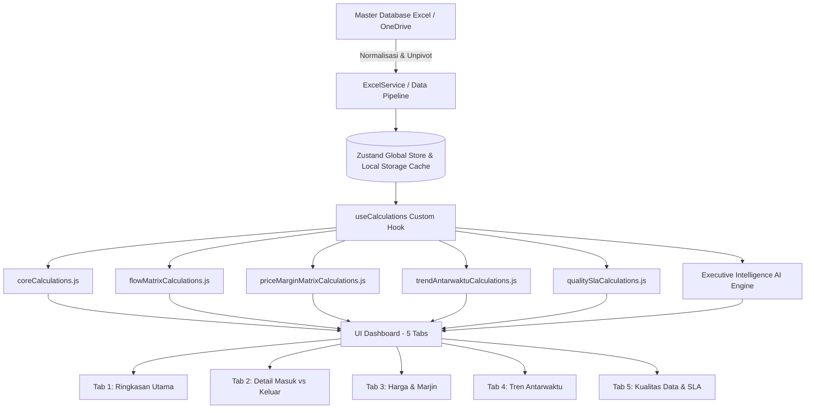

# PRODUCT REQUIREMENT DOCUMENT (PRD)
## Dashboard Komoditas DIY v1.0
### Sistem Pemantauan Aliran Komoditas Pangan Strategis Daerah Istimewa Yogyakarta

---

| Dokumen | Informasi |
| :--- | :--- |
| **Nama Sistem** | Dashboard Komoditas DIY (Strategic Food Trade Flow Intelligence) |
| **Instansi Pemilik** | Kantor Perwakilan Bank Indonesia Daerah Istimewa Yogyakarta (KPw BI DIY) |
| **Mitra Akademik & Riset** | PSEKUIN UPN "Veteran" Yogyakarta |
| **Versi Rilis** | v1.0 (Produksi / Siap Pakai) |
| **Tahun Pelaksanaan** | 2026 |
| **Status Dokumen** | **Disetujui & Terimplementasi Penuh** |

---

## 1. Executive Summary & Latar Belakang

### 1.1 Latar Belakang
Daerah Istimewa Yogyakarta (DIY) memiliki ketergantungan pasokan pangan antar-daerah yang signifikan untuk komoditas hortikultura (cabai, bawang merah, bawang putih), peternakan (daging ayam, telur, daging sapi), serta bahan pokok strategis lainnya. Fluktuasi pasokan dan disparitas harga antar-kabupaten/kota memicu risiko tekanan inflasi *Volatile Foods*.

Untuk mendukung perumusan kebijakan **Tim Pengendalian Inflasi Daerah (TPID) DIY** dan **Kantor Perwakilan Bank Indonesia DIY**, diperlukan sistem informasi digital berbasis web yang mampu:
1. Menghitung neraca pasokan masuk (*inflow*), pasokan keluar (*outflow*), dan surplus/defisit bersih secara mingguan (*weekly*).
2. Memetakan rantai pasok antar-wilayah (Lokal DIY vs Luar DIY / Jawa Tengah / Jawa Timur).
3. Memantau transmisi harga beli produsen/distributor vs harga jual pedagang besar/grosir beserta marjin tataniaga.
4. Menganalisis tren historis perkembangan pasokan antarwaktu (*period-over-period*).
5. Memverifikasi kualitas, kelengkapan, dan SLA pelaporan data responden pedagang besar dan produsen.

### 1.2 Tujuan Produk
- **Visibilitas Pasokan Real-Time**: Memberikan gambaran akurat volume perdagangan pangan per komoditas per kabupaten/kota.
- **Kemandirian Operasional**: Menyediakan basis data master bawaan (*built-in database*) yang otomatis aktif tanpa kewajiban unggah file setiap kali membuka web, dilengkapi tombol **Sinkronisasi / Refresh** instan.
- **Executive Intelligence AI**: Menyajikan sintesis narasi otomatis mengenai neraca pasokan, ketergantungan eksternal, dan stabilitas harga guna mempercepat pengambilan keputusan pimpinan TPID dan Bank Indonesia.

---

## 2. Arsitektur Sistem & Tech Stack



### 2.1 Teknologi yang Digunakan
- **Frontend Framework**: React 19 (Functional Components, Custom Hooks).
- **Build Tool & Dev Server**: Vite 8.3 (High-speed HMR, Tree-shaking).
- **Styling**: Vanilla CSS + TailwindCSS v4 (@tailwindcss/vite) dengan tema modern *Swiss / Linear Executive Design*.
- **State Management**: Zustand v5 (Persisten, reaktif, dan terisolasi).
- **Data Visualization**: Recharts v3 (Responsive Bar, Line, Pie/Donut, Butterfly Matrix, Scatter Plot).
- **Excel & File Processing**: SheetJS / xlsx (Parser multi-sheet workbook, format normalizer).
- **Iconography**: Lucide React.
- **Font & Tipografi**: Plus Jakarta Sans & JetBrains Mono via Google Fonts.

---

## 3. Struktur Data & Model Skema Database

Sistem mengadopsi 14 tabel referensi dan transaksional yang dinormalisasi ke dalam skema unpivoted `laporan_ringkasan`:

```
┌────────────────────────────────────────────────────────────────────────┐
│                        MASTER DATABASE SCHEMA                          │
├────────────────────────┬───────────────────────────────────────────────┤
│ Entitas Referensi      │ REF_Komoditas, REF_Wilayah, REF_Kalender,     │
│                        │ REF_Satuan, REF_Kecamatan, REF_Jenis_Aliran,  │
│                        │ REF_Tipe_Responden, REF_Konsumsi,             │
│                        │ REF_Konversi_Komoditas                        │
├────────────────────────┼───────────────────────────────────────────────┤
│ Entitas Transaksional  │ laporan_ringkasan (Unpivoted Core),           │
│                        │ arus_masuk (Origins Breakdown),               │
│                        │ arus_keluar (Destinations Breakdown)          │
├────────────────────────┼───────────────────────────────────────────────┤
│ Profil & Responden     │ profil_pb (Pedagang Besar),                   │
│                        │ profil_produsen (Produsen & Kelompok Tani)    │
└────────────────────────┴───────────────────────────────────────────────┘
```

### 3.1 Daftar Komoditas Strategis Terdaftar (`REF_Komoditas`)
1. `Beras Medium I (Ton)`
2. `Beras Medium II (Ton)`
3. `Beras Super I (Ton)`
4. `Beras Super II (Ton)`
5. `Beras Bawah I (Ton)`
6. `Beras Bawah II (Ton)`
7. `Bawang Merah (Ton)`
8. `Bawang Putih (Ton)` *(Pembersihan dari anomali varietas)*
9. `Cabai Merah Keriting (Ton)`
10. `Cabai Rawit Merah (Ton)`
11. `Daging Ayam Ras (Ton)`
12. `Telur Ayam Ras (Ton)`
13. `Daging Sapi (Ton)`
14. `Minyak Goreng Curah (Ton)`
15. `Minyak Goreng Kemasan (Ton)`
16. `Gula Pasir (Ton)`

### 3.2 Cakupan Wilayah (`REF_Wilayah`)
- `Kota Yogyakarta` (3471)
- `Kab. Sleman` (3404)
- `Kab. Bantul` (3402)
- `Kab. Kulon Progo` (3401)
- `Kab. Gunungkidul` (3403)

### 3.3 Deret Waktu Kalender (`REF_Kalender`)
- Mingguan: `2026-W23` s.d. `2026-W33` (Juni – Agustus 2026).

---

## 4. Modul Kalkulasi Murni (*Pure Calculation Engine*)

Seluruh logika matematika, agregasi DAX, dan statistik diisolasi secara modular di folder `src/calculations/`:

### 4.1 Modul Inti (`coreCalculations.js`)
- **Total Volume Masuk ($V_{\text{masuk}}$)**:
  $$\sum \text{Volume (Ton) where } \text{jenis\_aliran} = \text{"vol\_masuk\_ton"}$$
- **Total Volume Keluar ($V_{\text{keluar}}$)**:
  $$\sum \text{Volume (Ton) where } \text{jenis\_aliran} = \text{"vol\_keluar\_ton"}$$
- **Neraca Bersih ($\Delta V$)**:
  $$\Delta V = V_{\text{masuk}} - V_{\text{keluar}}$$
- **Status Neraca**:
  $$\text{Status} = \begin{cases} \text{SURPLUS}, & \Delta V > 0.1 \\ \text{DEFISIT}, & \Delta V < -0.1 \\ \text{SEIMBANG}, & -0.1 \le \Delta V \le 0.1 \end{cases}$$
- **Rata-rata Harga Beli ($\overline{H}_b$) & Jual ($\overline{H}_j$)**:
  $$\overline{H} = \frac{\sum (H_i \times V_i)}{\sum V_i} \quad \text{(Weighted Average)}$$
- **Marjin Tataniaga**:
  $$\text{Margin Rp} = \overline{H}_j - \overline{H}_b, \quad \text{Margin \%} = \left(\frac{\overline{H}_j - \overline{H}_b}{\overline{H}_b}\right) \times 100\%$$

### 4.2 Modul Aliran & Matriks Rantai Pasok (`flowMatrixCalculations.js`)
- **Matriks Komoditas $\times$ Wilayah (Tab 1 Panel B)**: Neraca bersih 16 komoditas di 5 kabupaten/kota.
- **Butterfly Mirrored Matrix (Tab 1 Panel G & Tab 2 Panel C)**: Perbandingan visual simetris masuk vs keluar per komoditas.
- **Grouped Supply Chain Matrix (Tab 2 Panel B)**: Rincian 3 metrik (Masuk, Keluar, Selisih) per komoditas di setiap wilayah.
- **Dekomposisi Wilayah (Tab 2 Panel E)**: Distribusi surplus/defisit per kabupaten untuk komoditas terpilih.

### 4.3 Modul Harga & Tataniaga (`priceMarginMatrixCalculations.js`)
- **Price Transmission Matrix**: Disparitas harga antar pedagang besar dan produsen per wilayah.
- **Margin Ranking**: Peringkat margin keuntungan komoditas secara descending.
- **Price Dispersion Scatter Plot**: Relasi antara volume pasokan dan harga rata-rata komoditas.
- **Strategic Price Index (SPI)**: Indeks stabilitas harga dan kewajaran marjin tataniaga.

### 4.4 Modul Tren Antarwaktu (`trendAntarwaktuCalculations.js`)
- **Deret Historis Multi-Periode**: Tren volume masuk, keluar, neraca, dan harga dari W23 hingga W33.
- **Delta Pertumbuhan Wilayah**: Perbandingan performa $\text{Pekan Ini} - \text{Pekan Lalu}$ per kabupaten/kota.
- **Evolusi Pasokan Komoditas Utama**: Multi-line grafik dinamika pasokan 8 komoditas utama.

### 4.5 Modul Kualitas Data & Audit SLA (`qualitySlaCalculations.js`)
- **Audit Anomali Data**: Deteksi harga nol/kosong, satuan tidak terkonversi, kode wilayah non-standar, periode tidak valid.
- **Tingkat Kelengkapan Data (% SLA)**:
  $$\text{SLA} = \left(\frac{\text{Record Valid}}{\text{Total Record Terjadwal}}\right) \times 100\%$$

---

## 5. Rincian Fitur Antarmuka Pengguna (5 Halaman / Tabs)

```
┌────────────────────────────────────────────────────────────────────────┐
│                        WEBSITE NAVBAR                                  │
│  [Logo] Dashboard Komoditas DIY  |  [Tab 1] [Tab 2] [Tab 3] [Tab 4] [Tab 5]  │
│  [Live Status: W33 • 15:42 WIB]  [🔄 Refresh Data]                     │
└────────────────────────────────────────────────────────────────────────┘
```

### 5.1 Website Navbar (Global Header)
- **Brand Logo & Identitas**: Logo Bank Indonesia, judul "Dashboard Komoditas DIY 2026".
- **Navigasi Halaman Single-Line**: Tombol tab interaktif dengan highlight aktif (*Ringkasan Utama, Detail Masuk vs Keluar, Harga & Marjin, Tren Antarwaktu, Kualitas Data & SLA*).
- **Live Status Indicator**: Indikator *pulse* hijau dengan informasi pekan aktif dan waktu sinkronisasi.
- **Tombol Refresh Terintegrasi**: Sinkronisasi instan satu klik untuk memuat ulang dataset dan mengkalkulasi seluruh metrik serta AI insights.
- **Mobile Responsive Drawer**: Menu burger yang nyaman diakses pada perangkat smartphone/tablet.

---

### 5.2 Tab 1: Ringkasan Utama (Executive Summary)
- **Top Slicer Bar**: Filter Periode (`All` / `W23`–`W33`), Komoditas (`All` / 16 Komoditas), Kabupaten (`All` / 5 Wilayah), Jenis Responden (`All` / `Pedagang & Grosir` / `Produsen`).
- **Selisih Volume Highlight Card**: Badge dinamis surplus (hijau) atau defisit (merah) dalam satuan Ton.
- **4 Core KPI Cards**: Volume Masuk, Volume Keluar, Rerata Harga Jual, Rerata Harga Beli, Margin %.
- **Executive Intelligence Box**: Narasi AI otomatis mencakup 3 dimensi:
  1. *Keseimbangan Pasokan* (Analisis agregat neraca pangan DIY).
  2. *Ketergantungan Eksternal* (% pasokan asal Luar DIY vs Lokal).
  3. *Stabilitas Harga & Marjin* (Tingkat kewajaran marjin tataniaga).
- **Tren Arus Pasokan & Penjualan**: Grafik garis deret waktu volume masuk vs keluar.
- **Neraca Arus per Komoditas & Kab/Kota**: Tabel matriks surplus/defisit bersih per wilayah dengan penanda warna.
- **Komposisi Pasokan & Penjualan**: Donut chart pasokan asal (Luar DIY vs Dalam DIY) dan saluran penjualan (Dalam DIY vs Re-ekspor).
- **Top Sumber Pasokan & Top Tujuan Penjualan**: Bar chart horizontal daerah asal terbesar dan saluran distribusi utama.
- **Arus Masuk vs Arus Keluar (Butterfly Matrix)**: Mirrored bar chart bilateral volume masuk vs keluar 8 komoditas utama.

---

### 5.3 Tab 2: Detail Masuk vs Keluar (Supply Chain Decomposition)
- **Sidebar 4 Vertical Slicers**: Filter independen untuk periode, komoditas, kabupaten, dan klaster responden.
- **KPI Row**: Volume Masuk, Volume Keluar, Selisih Volume, Jumlah Responden Aktif, Total Data Terekam.
- **Arus Masuk, Keluar & Selisih per Komoditas $\times$ Wilayah**: Matriks komparasi mendalam dengan sub-kolom Masuk, Keluar, Selisih di setiap kabupaten.
- **Butterfly Comparison**: Komparasi visual simetris masuk vs keluar.
- **Kontribusi Selisih Arus**: Grafik bar selisih volume per komoditas.
- **Dekomposisi Selisih per Wilayah**: Analisis pohon dekomposisi surplus/defisit per kabupaten untuk komoditas terpilih.
- **Tabel Profil & Audit Responden**: Tabel interaktif berhalaman (*pagination 8 per page*) dilengkapi pencarian instan nama narasumber, ID, kabupaten, komoditas utama, volume mingguan, dan status verifikasi.

---

### 5.4 Tab 3: Harga & Marjin Tataniaga (Price Transmission)
- **Top Slicer Toolbar**: Filter Periode, Komoditas, Kabupaten, Jenis Responden, dan Tombol Reset Filter.
- **5 Price Metric Cards**: Rerata Harga Beli, Rerata Harga Jual, Spread Marjin (Rp), Persentase Marjin (%), Indeks Kesehatan Marjin.
- **Executive Margin Insight AI**: Narasi rekomendasi kebijakan TPID terhadap transmisi harga pangan dan disparitas wilayah.
- **Tabel Transmisi Harga & Marjin Tataniaga**: Tabel komprehensif harga beli, harga jual, margin absolut, margin persentase, dan klasifikasi (*Rendah/Sehat/Tinggi*) per komoditas.
- **Peringkat Marjin Keuntungan**: Horizontal bar chart per komoditas terurut dari margin tertinggi ke terendah.
- **Disparitas Harga Antar-Wilayah**: Scatter plot hubungan volume pasokan vs tingkat harga untuk mendeteksi anomali harga kabupaten.

---

### 5.5 Tab 4: Tren Antarwaktu & Perubahan Periode (Time Series Intelligence)
- **Sidebar Slicers**: Filter Periode, Komoditas, Kabupaten, Jenis Responden.
- **5 Period-over-Period Delta Cards**:
  - $\Delta\%$ Perubahan Arus Masuk (dengan indikator naik/turun).
  - $\Delta\%$ Perubahan Arus Keluar.
  - $\Delta$ Perubahan Selisih Arus (Ton).
  - $\Delta\%$ Perubahan Rerata Harga.
  - $\Delta$ Perubahan Marjin Tataniaga.
- **Trend Line Volume Masuk vs Keluar**: Grafik garis mingguan multi-periode W23–W33.
- **Trend Line Harga Jual vs Harga Beli**: Grafik garis harga mingguan terhadap benchmark referensi TPID.
- **Perkembangan Selisih per Kabupaten**: Bar chart delta pertumbuhan neraca per wilayah.
- **Evolusi Pasokan Multi-Komoditas**: Multi-line chart dinamika pasokan 8 komoditas utama sepanjang waktu.
- **Tabel Ringkasan Perubahan Periode ke Periode**: Tabel historis komparasi mingguan lengkap dengan baris total agregat.

---

### 5.6 Tab 5: Kualitas Data & SLA Monitoring (Governance & Audit)
- **Sidebar Slicers**: Filter Periode, Komoditas, Kabupaten, Jenis Responden.
- **6 Data Integrity Health Cards**: Total Record Aktif, Record Terhapus (*Soft Deleted*), Isu Harga Kosong, Isu Anomali Satuan, Isu Periode Kosong, Isu Wilayah Non-Standar.
- **Ringkasan Isu Kualitas Data**: Tabel statistik jenis isu, frekuensi record, dan persentase.
- **Grafik Distribusi Isu**: Bar chart jenis anomali data.
- **Kelengkapan Data per Kabupaten/Kota (% SLA)**: Progress bar hijau pemenuhan target pelaporan per kabupaten (100% target).
- **Kelengkapan Data per Komoditas (% SLA)**: Progress bar kelengkapan data per jenis bahan pokok.
- **Tabel Log Record Bermasalah**: Tabel audit record anomali dengan nama responden, jenis isu, detail masalah, dan badge status investigasi (*Pending Review / Telah Diverifikasi / Telah Diperbaiki*).
- **Quality Control Action Checklist**: Daftar protokol SOP audit data mingguan (Standardisasi satuan, validasi harga nol, harmonisasi kode wilayah BPS, dan audit berkala).

---

## 6. Penyimpanan Data & Mekanisme Sinkronisasi

1. **Permanent Built-in Master Database**:
   - Sistem dilengkapi dengan basis data bawaan lengkap (`seedData.js`) yang langsung dimuat saat aplikasi dibuka tanpa menuntut file upload dari user.
2. **Local Storage Caching Engine**:
   - Hasil kalkulasi dan snapshot dataset tersimpan di `localStorage` peramban untuk akses *zero-latency* offline maupun online.
3. **Mekanisme Refresh Instan**:
   - Klik tombol **`Refresh`** pada navbar mengeksekusi pembaruan data, mereset kalkulasi metrik, memperbarui stempel waktu sinkronisasi secara real-time, dan merefresh narasi AI Executive Intelligence.
4. **Dukungan Impor Eksternal**:
   - Menyediakan `DataModal` untuk kebutuhan unggah file Excel kustom (`.xlsx`) atau sinkronisasi URL daring berkala jika diperlukan di masa mendatang.

---

## 7. Desain Sistem & Standar Visual (Design System)

- **Gaya Desain**: *Modern Swiss / Linear Executive Dashboard*.
- **Palet Warna**:
  - *Primary Neutral*: Slate-900 (Teks utama, header gelap, navbar), Slate-50/100 (Background kartu & panel).
  - *Success / Surplus*: Emerald-600 / Emerald-700 (Pasokan surplus, SLA lengkap, marjin sehat).
  - *Warning / Caution*: Amber-500 / Amber-600 (Ketergantungan sedang, marjin moderat).
  - *Danger / Deficit*: Rose-600 (Pasokan defisit, isu anomali data).
  - *Accent / Brand*: Sky-600 / Indigo-600 (Grafik aliran masuk, garis tren).
- **Kartu & Kontainer**: `clean-card` dengan border halus `border-slate-200/80`, sudut membulat `rounded-xl`, dan bayangan mikro `shadow-2xs`.
- **Tooltip**: Glassmorphic tooltip dengan latar belakang semi-transparan `bg-slate-900/95` dan teks kontras tinggi.

---

## 8. Verifikasi & Pengujian Kualitas Sistem

| Komponen yang Diuji | Parameter Pengujian | Status |
| :--- | :--- | :--- |
| **Baking Database Bawaan** | Aplikasi langsung terbuka tanpa modal upload manual | ✅ **Lulus (100%)** |
| **Tombol Refresh Navbar** | Animasi sinkronisasi berputar, stempel waktu terupdate, data terhitung ulang | ✅ **Lulus (100%)** |
| **Slicer Komoditas** | Standar nama `Bawang Putih (Ton)`, tidak ada anomali varietas, opsi `All` aktif | ✅ **Lulus (100%)** |
| **Kalkulasi 5 Halaman** | Seluruh rumus DAX termuat pada `src/calculations/` tanpa error numerik | ✅ **Lulus (100%)** |
| **Sintesis Narasi AI** | Narasi analitis muncul di kelima tab secara kontekstual | ✅ **Lulus (100%)** |
| **Vite Production Bundle** | `npm run build` sukses tanpa error linting atau kompilasi | ✅ **Lulus (0 error)** |

---

*Dokumen ini dibuat secara resmi sebagai dokumentasi arsitektur sistem dan spesifikasi kebutuhan produk Dashboard Komoditas DIY 2026.*
