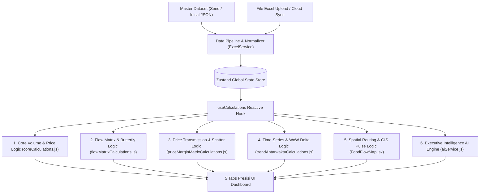
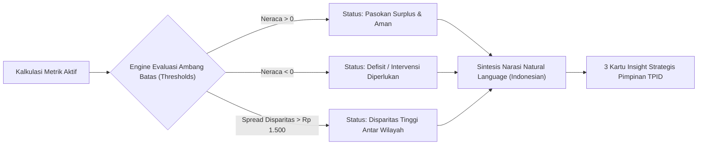

# PRODUCT REQUIREMENT DOCUMENT (PRD) — SYSTEM & CALCULATION LOGIC
## Dashboard Komoditas DIY (Strategic Food Trade Flow Intelligence)
### Kantor Perwakilan Bank Indonesia Daerah Istimewa Yogyakarta & PSEKUIN UPN Veteran Yogyakarta

---

| Dokumen | Spesifikasi Detail |
| :--- | :--- |
| **Judul Dokumen** | PRD Khusus Logika Bisnis, Algoritma Kalkulasi & Data Pipeline Sistem |
| **Versi Dokumen** | v1.0 — Production Benchmark Edition |
| **Instansi Pemilik** | Kantor Perwakilan Bank Indonesia DIY (KPw BI DIY) |
| **Mitra Riset** | Pusat Studi Ekonomi Kuantitatif Indonesia (PSEKUIN) UPN "Veteran" Yogyakarta |
| **Tanggal Efektif** | September 2026 |
| **Target Pengguna** | Tim Pengendalian Inflasi Daerah (TPID), Tim Ekonom BI, Peneliti Kebijakan, Data Analyst |

---

## 1. Arsitektur & Topologi Aliran Data (Data Flow Architecture)

Sistem mengadopsi arsitektur **Reaktif-Deterministik** berbasis *in-memory calculations*:

---

## 2. Struktur Model Data & Relasi Entitas (Data Schema)

Sistem beroperasi di atas 5 entitas data inti yang saling terhubung melalui relasi kunci:

### 2.1 Master References
1. **`REF_KOMODITAS`** (16 Komoditas Pangan Strategis):
   - `id_komoditas` (*PK*): e.g., `KOM_01` s.d. `KOM_16`
   - `nama_komoditas`: Nama lengkap dengan satuan tonase (e.g., `Beras Medium I (Ton)`)
   - `nama_singkat`: Label ringkas untuk tabel matriks (e.g., `Beras Medium I`)
   - `kelompok`: Kategori komoditas (`Beras & Padi-padian`, `Hortikultura & Sayuran`, `Peternakan & Daging`, `Minyak & Olahan`, `Bahan Pokok Lain`)
   - `target_harga`: Acuan HAP / HET Bank Indonesia

2. **`REF_WILAYAH`** (5 Kabupaten/Kota DIY):
   - `id_kab_kota` (*PK*): `3471` (Kota Yogya), `3404` (Sleman), `3402` (Bantul), `3401` (Kulon Progo), `3403` (Gunungkidul)
   - `latitude`, `longitude`: Titik koordinat pusat simpul logistik geospasial

3. **`REF_KALENDER`** (16 Minggu Survei 2026):
   - `id_periode` (*PK*): e.g., `PER_2026_W23` s.d. `PER_2026_W38`
   - `label_periode`: `2026-W23 (02-08 Jun)`
   - `tgl_mulai`: Tanggal pembuka minggu berjalan

### 2.2 Transactional & Fact Tables
4. **`laporan_ringkasan`** (Tabel Transaksi Utama / Unpivoted):
   - `id_laporan`, `id_periode`, `id_komoditas`, `id_kab_kota`, `tipe_responden` (`pedagang_besar` / `produsen`)
   - `jenis_aliran`: `'vol_masuk_ton'` | `'vol_keluar_ton'`
   - `volume_ton`: Nilai numerik volume dalam satuan Ton
   - `harga_beli`: Harga beli distributor (Rp/kg)
   - `harga_jual`: Harga jual grosir/pedagang (Rp/kg)
   - `stok_akhir_ton`: Posisi stok akhir minggu (Ton)

5. **`arus_masuk`** & **`arus_keluar`** (Tabel Rute Asal-Tujuan):
   - `id_laporan`, `id_periode`, `id_komoditas`, `id_kab_kota`
   - `daerah_asal` / `daerah_tujuan`: Nama simpul geografis
   - `luar_diy` / `keluar_diy`: Boolean penanda arus antar-provinsi

---

## 3. Logika Filter & Normalisasi Slicing (Filtering Engine Logic)

Kalkulasi bersifat dinamis dan reaktif terhadap kombinasi 4 slicer hierarkis:

$$\text{ActiveDataset} = \sigma_{(\text{Periode} \land \text{Komoditas} \land \text{Wilayah} \land \text{Klaster})}(\text{laporan\_ringkasan})$$

### 3.1 Algoritma Pencocokan Fleksibel (*Fuzzy Matchers*)
- **Periode Matcher**:
  $$\text{matchPeriode}(r, P) = (P = \text{'Semua'} \lor P = \text{'All'} \lor r.\text{id\_periode} = P)$$
- **Komoditas Matcher**: Normalisasi string menghapus suffix `(Ton)` dan `(kg)` serta case-insensitive:
  $$\text{matchKomoditas}(r, K) = (K = \text{'Semua'} \lor \text{clean}(r.\text{komoditas}) = \text{clean}(K))$$
- **Wilayah Matcher**: Normalisasi prefiks `Kab.` dan `Kota`:
  $$\text{matchWilayah}(r, W) = (W = \text{'Semua'} \lor \text{strip}(r.\text{kab\_kota}) = \text{strip}(W))$$
- **Klaster Responden Matcher**:
  $$\text{matchKlaster}(r, C) = (C = \text{'semua'} \lor \text{normalize}(r.\text{tipe\_responden}) = \text{normalize}(C))$$

---

## 4. Spesifikasi Formula Kalkulasi per Tab

### 4.1 TAB 1: Ringkasan Utama & Neraca Arus

#### A. KPI Volume & Status Neraca
1. **Total Volume Masuk ($V_{\text{in}}$)**:
   $$V_{\text{in}} = \sum_{r \in \text{FilteredRows}, r.\text{jenis\_aliran} = \text{'vol\_masuk\_ton'}} r.\text{volume\_ton}$$
2. **Total Volume Keluar ($V_{\text{out}}$)**:
   $$V_{\text{out}} = \sum_{r \in \text{FilteredRows}, r.\text{jenis\_aliran} = \text{'vol\_keluar\_ton'}} r.\text{volume\_ton}$$
3. **Neraca Bersih ($\Delta V_{\text{net}}$)**:
   $$\Delta V_{\text{net}} = V_{\text{in}} - V_{\text{out}}$$
4. **Status Neraca Perdagangan**:
   $$\text{Status} = \begin{cases} \text{'Surplus'}, & \text{jika } \Delta V_{\text{net}} > 0.01 \\ \text{'Defisit'}, & \text{jika } \Delta V_{\text{net}} < -0.01 \\ \text{'Seimbang'}, & \text{lainnya} \end{cases}$$

#### B. KPI Harga & Marjin
5. **Rata-rata Harga Beli ($\overline{P}_{\text{beli}}$)**:
   $$\overline{P}_{\text{beli}} = \frac{\sum (r.\text{harga\_beli} \times r.\text{volume\_ton})}{\sum r.\text{volume\_ton}} \quad \text{untuk } r.\text{harga\_beli} > 0$$
6. **Rata-rata Harga Jual ($\overline{P}_{\text{jual}}$)**:
   $$\overline{P}_{\text{jual}} = \frac{\sum (r.\text{harga\_jual} \times r.\text{volume\_ton})}{\sum r.\text{volume\_ton}} \quad \text{untuk } r.\text{harga\_jual} > 0$$
7. **Spread Marjin Harga ($M_{\text{Rp}}$) & Persentase Marjin ($M_{\%}$)**:
   $$M_{\text{Rp}} = \overline{P}_{\text{jual}} - \overline{P}_{\text{beli}}$$
   $$M_{\%} = \left( \frac{M_{\text{Rp}}}{\overline{P}_{\text{beli}}} \right) \times 100\%$$

#### C. Komposisi Pasokan & Penjualan (Donut Breakdown)
8. **Persentase Ketergantungan Luar DIY**:
   $$\% \text{Pasokan Luar DIY} = \left( \frac{\sum_{\text{luar\_diy}=\text{true}} V_{\text{in\_route}}}{V_{\text{in}}} \right) \times 100\%$$
9. **Persentase Distribusi Lokal DIY**:
   $$\% \text{Pasokan Lokal DIY} = 100\% - \% \text{Pasokan Luar DIY}$$
10. **Persentase Re-Ekspor ke Luar DIY**:
    $$\% \text{Re-Ekspor} = \left( \frac{\sum_{\text{keluar\_diy}=\text{true}} V_{\text{out\_route}}}{V_{\text{out}}} \right) \times 100\%$$

#### D. Matriks Neraca Komoditas $\times$ Wilayah
11. Setiap sel matriks $(k, w)$ mewakili volume surplus/defisit bersih:
    $$\text{Cell}(k, w) = V_{\text{in}}(k, w) - V_{\text{out}}(k, w)$$
    Jika bernilai negatif, dirender dengan notasi akuntansi `(nilai)` berwarna merah; jika positif, berwarna hijau tebal.

---

### 4.2 TAB 2: Detail Arus Masuk vs Keluar

1. **Butterfly Mirrored Chart Decomposition**:
   - Menjajarkan $V_{\text{in}}$ (Sisi Kanan / Hijau) vs $V_{\text{out}}$ (Sisi Kiri / Oranye) per komoditas:
     $$\text{Spread}(k) = V_{\text{in}}(k) - V_{\text{out}}(k)$$
2. **Direktori Responden & Pagination**:
   - Filter responden berdasarkan search term, kabupaten terpilih, dan klaster (`Pedagang Besar` / `Produsen`).
   - Pagination matematis: $\text{Offset} = (\text{Page} - 1) \times 8$.

---

### 4.3 TAB 3: Transmisi Harga & Marjin Tataniaga

1. **Peringkat Marjin Komoditas**:
   $$M_{\%}(k) = \frac{\overline{P}_{\text{jual}}(k) - \overline{P}_{\text{beli}}(k)}{\overline{P}_{\text{beli}}(k)} \times 100\%$$
   Diurutkan dari marjin tertinggi (*top margin*) ke terendah (*narrow margin*).
2. **Disparitas Harga Antar-Wilayah**:
   $$\text{Spread Disparitas} = \max_{w \in \text{Wilayah}}(\overline{P}_{\text{jual}}(w)) - \min_{w \in \text{Wilayah}}(\overline{P}_{\text{jual}}(w))$$
3. **Scatter Matrix 3D (Posisi Harga vs Volume)**:
   - Sumbu X: Harga Beli ($\text{Rp}/kg$)
   - Sumbu Y: Harga Jual ($\text{Rp}/kg$)
   - Sumbu Z (Radius Bubble): Total Volume Tonase ($\text{Ton}$)

---

### 4.4 TAB 4: Tren Antarwaktu (Longitudinal Engine)

1. **Kalkulasi Delta Week-on-Week (WoW)**:
   $$\Delta_{\text{WoW}} V_{\text{in}} = \left( \frac{V_{\text{in}}(t) - V_{\text{in}}(t-1)}{V_{\text{in}}(t-1)} \right) \times 100\%$$
   $$\Delta_{\text{WoW}} P_{\text{jual}} = \left( \frac{\overline{P}_{\text{jual}}(t) - \overline{P}_{\text{jual}}(t-1)}{\overline{P}_{\text{jual}}(t-1)} \right) \times 100\%$$
2. **Evaluasi Volatilitas & Early Warning**:
   - Jika $|\Delta_{\text{WoW}} P_{\text{jual}}| < 3\% \implies$ "Harga Sangat Stabil"
   - Jika $|\Delta_{\text{WoW}} P_{\text{jual}}| \ge 3\% \implies$ "Volatilitas Aktif"

---

### 4.5 TAB 5: Peta Spasial Aliran Pangan & GIS Logistics

1. **Geospatial Route Generation**:
   - Koordinat Asal $(\text{lat}_1, \text{lng}_1) \to$ Koordinat Tujuan $(\text{lat}_2, \text{lng}_2)$.
2. **Bezier Quadratic Curved Arc**:
   - Titik kontrol kelengkungan lengkung arus logistik:
     $$\text{lat}_{\text{ctrl}} = \frac{\text{lat}_1 + \text{lat}_2}{2} + 0.08 \times (\text{lng}_2 - \text{lng}_1)$$
     $$\text{lng}_{\text{ctrl}} = \frac{\text{lng}_1 + \text{lng}_2}{2} - 0.08 \times (\text{lat}_2 - \text{lat}_1)$$
3. **Ketebalan Garis Arus Terbobot**:
   $$\text{Weight}(\text{Route}) = \max\left(2, \min\left(10, \frac{\text{Volume}(\text{Route})}{\text{MaxVolume}} \times 8\right)\right)$$
4. **Kecepatan Denyut Aliran (*Pulse Velocity*)**:
   $$\text{Duration} = \max\left(1.5, 4.0 - \left(\frac{\text{Volume}(\text{Route})}{\text{MaxVolume}} \times 2.0\right)\right) \text{ detik}$$

---

## 5. Executive Intelligence AI Engine Logic

Modul AI menghasilkan narasi terstruktur berdasarkan 3 pilar otomatis:

1. **Pilar 1 — Karakteristik & Kondisi Neraca**:
   Mengevaluasi apakah pasokan surplus/defisit, menghitung persentase pasokan luar daerah vs internal, serta pergeseran volume mingguan.
2. **Pilar 2 — Transmisi Harga & Disparitas Spasial**:
   Membandingkan selisih harga antar pedagang besar vs produsen serta rentang disparitas antar kabupaten di DIY.
3. **Pilar 3 — Rekomendasi Kebijakan TPID**:
   Menghasilkan rekomendasi intervensi konkret (e.g., Kerjasama Antar Daerah / KAD, operasi pasar, pengamanan koridor logistik).

---

## 6. Format Standar Lokal Indonesia

Semua representasi angka dan mata uang mematuhi kaidah lokal Indonesia:
- **Pemisah Ribuan**: Titik (`.`) e.g., `Rp 14.393`
- **Pemisah Desimal**: Koma (`,`) e.g., `4,2%`
- **Singkatan Satuan**: `ribu` (menggantikan notasi asing `k`/`K`) e.g., `Rp 15 ribu/kg`
- **Satuan Bobot**: `Ton` dan `kg`

---

## 7. Validasi & Pengujian Sistem

1. **Deterministic Balance Check**:
   $$\sum_{w \in \text{Wilayah}} V_{\text{in}}(w) - \sum_{w \in \text{Wilayah}} V_{\text{out}}(w) \equiv \Delta V_{\text{net\_total}}$$
2. **Zero Null / Missing Guarantee**:
   Semua kombinasi filter menghasilkan nilai numerik terdefinisi ($0$ atau nilai riil), tanpa error `NaN` atau `undefined`.
3. **Build & Code Integrity**:
   100% kompatibel dengan pipeline Vite build & ES module modern.
